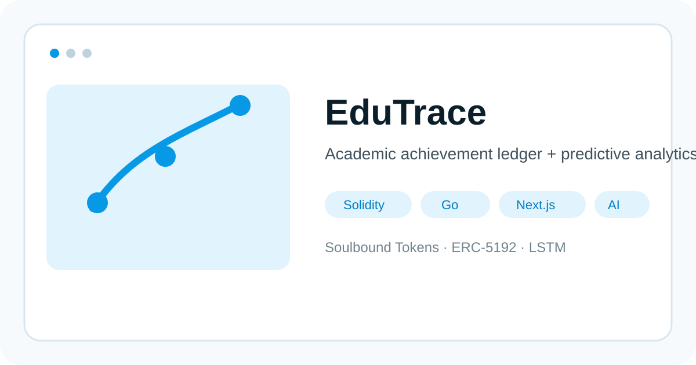
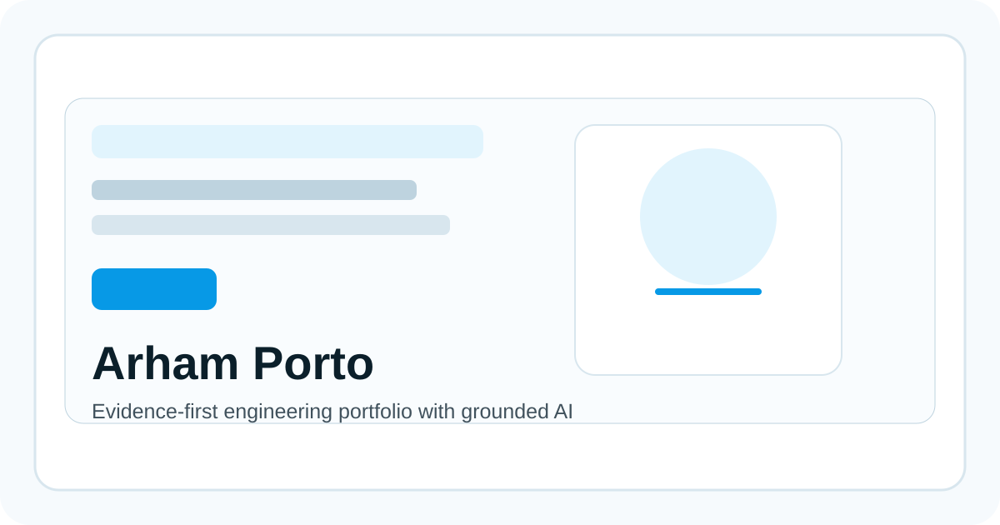
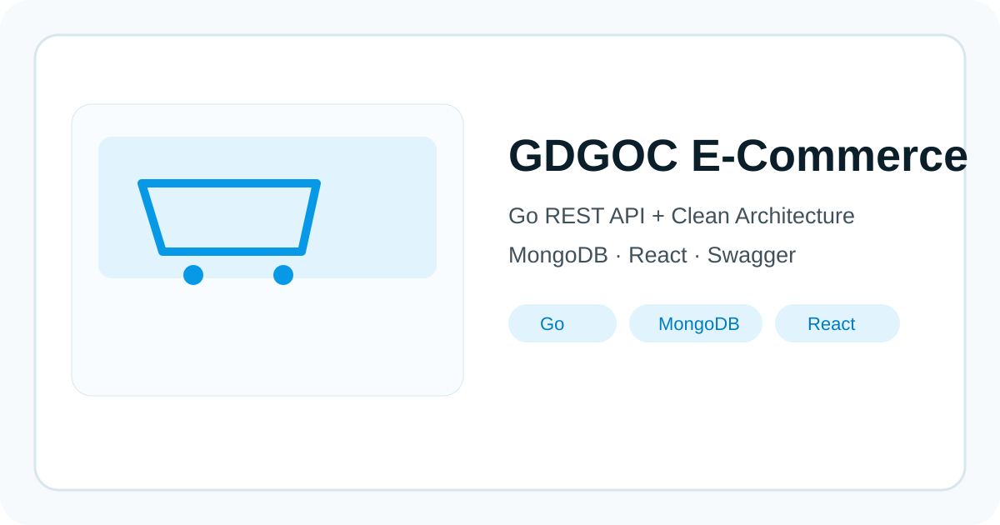
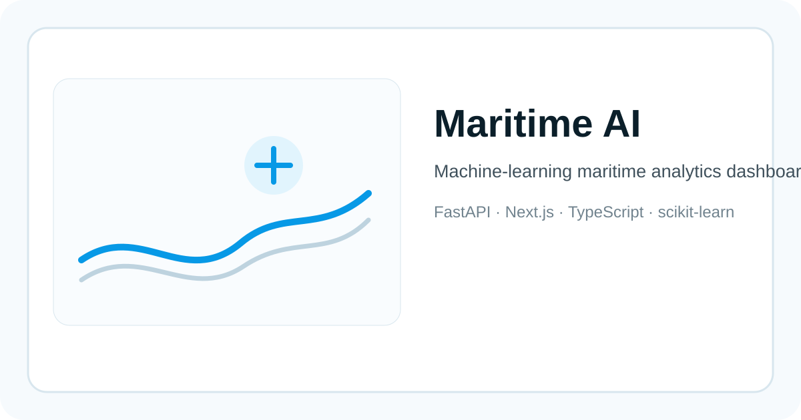
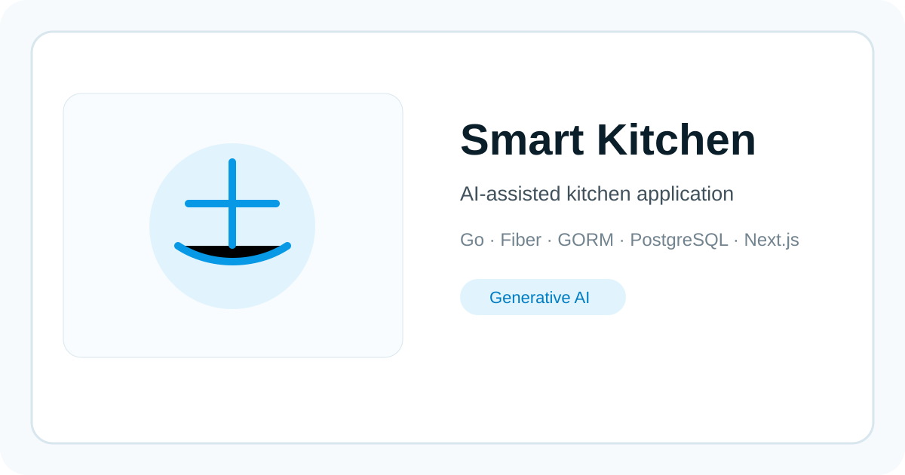

# Hi, I'm Nachsyas Arham Mumtaz Nashohi 👋

### Software Engineer

Computer Science undergraduate at **UIN Maulana Malik Ibrahim Malang** focused on backend engineering, modern web applications, AI-enabled systems, and Web3 experimentation.

  <a href="https://arham-porto.vercel.app"><strong>Portfolio</strong></a>
  ·
  <a href="https://github.com/Nachsyas?tab=repositories"><strong>Repositories</strong></a>

  
  
  
  
  
  

---

## 🚀 Featured Engineering Projects

<table>
<tr>
<td width="50%" valign="top">

### [EduTrace](https://github.com/Nachsyas/EduTrace)

Decentralized academic achievement system combining **Soulbound Tokens (ERC-5192)** with predictive academic analytics.

**Stack:** Solidity · Foundry · Next.js · Go · Python/LSTM · PostgreSQL

[Repository →](https://github.com/Nachsyas/EduTrace)

</td>
<td width="50%" valign="top">

### [Arham Porto](https://github.com/Nachsyas/Arham-Porto)

Multi-page engineering portfolio with evidence-linked project exploration and **Ask Arham AI**.

**Stack:** Next.js · TypeScript · Go · PostgreSQL/pgvector · Groq · Cloudflare Workers AI

[Live Portfolio →](https://arham-porto.vercel.app) · [Repository →](https://github.com/Nachsyas/Arham-Porto)

</td>
</tr>

<tr>
<td width="50%" valign="top">

### [GDGOC E-Commerce](https://github.com/Nachsyas/gdgoc-ecommerce)

Team-built e-commerce platform with a **Go REST API**, Clean Architecture, MongoDB, and Swagger documentation.

**Stack:** Go · MongoDB · React · Swagger · GitHub Actions

[Repository →](https://github.com/Nachsyas/gdgoc-ecommerce)

</td>
<td width="50%" valign="top">

### [Maritime AI Dashboard](https://github.com/Nachsyas/maritime-ai-dashboard)

Machine-learning-backed maritime analytics dashboard with a modern web interface and Python API layer.

**Stack:** FastAPI · Next.js · TypeScript · Tailwind CSS · scikit-learn

[Repository →](https://github.com/Nachsyas/maritime-ai-dashboard)

</td>
</tr>

<tr>
<td colspan="2" valign="top">

### Smart Kitchen

A split frontend/backend project for an AI-assisted kitchen application, with a Go service layer and a Next.js interface.

**Stack:** Go · Fiber · GORM · PostgreSQL · Next.js · Generative AI

[Frontend →](https://github.com/Nachsyas/smart-kitchen-frontend) · [Backend →](https://github.com/Nachsyas/smart-kitchen-backend)

</td>
</tr>
</table>

> Project previews are stored directly in this profile repository so they render reliably on GitHub. They can be replaced later with real landing-page screenshots without changing the layout.

---

## 🧭 Engineering Focus

| Area | What I Work With |
|---|---|
| **Backend Engineering** | Go, REST APIs, Clean Architecture, PostgreSQL, MongoDB |
| **Frontend Engineering** | TypeScript, Next.js, React, responsive application interfaces |
| **AI / ML** | Python, FastAPI, scikit-learn, LSTM-based workflows, evidence-grounded AI features |
| **Web3** | Solidity, Foundry, ERC-5192, smart-contract-backed applications |

---

## 🌐 Portfolio

My main portfolio is available at:

### [arham-porto.vercel.app →](https://arham-porto.vercel.app)

It contains project case studies, verified skill evidence, an interactive journey, and the **Ask Arham AI** portfolio reviewer.

---

<strong>📚 Mobile Programming Coursework Archive</strong>

 

| No | Date | Practicum | Topic | Report | Repository |
|---:|---|---:|---|---|---|
| 1 | 06-09-2025 | 01 | Pengenalan Mobile Programming dan Setup Lingkungan | [Modul 01](https://docs.google.com/document/d/1Kn4KNhzivys6uMHXTGxf5xX7DLHnPihJh6Rk7rgBBx8/edit?tab=t.0) | [Program](https://github.com/Nachsyas/Modul-1-Prak.-Mobile-Programming) |
| 2 | 06-09-2025 | 01 | Widget Row dan Column | [Modul 02](https://docs.google.com/document/d/1pQGA1cKk1tcE59S8_bHiKBKkPRiCMBUxpjsks9mFiiQ/edit?usp=sharing) | [Program](https://github.com/Nachsyas/Modul-2-3-Prak.-Mobile-Programming) |
| 3 | 12-09-2025 | 02 | Pengaturan Layout Row dan Column di Flutter | [Modul 03](https://docs.google.com/document/d/1F3Lhb9ZmY5gYcXkvdi1KO7sWWRs0NzfsD_o3hFecIIo/edit?usp=sharing) | [Program](https://github.com/Nachsyas/Modul-2-3-Prak.-Mobile-Programming) |
| 4 | 12-09-2025 | 02 | Widget Flexible dan Expanded | [Modul 04](https://docs.google.com/document/d/1G1gcRE0Hl4nnQDvqdr4sgr-QgllTVVS6omQLjaqQ97w/edit?usp=sharing) | [Program](https://github.com/Nachsyas/Modul-4-Praktikum-Pemrograman-Mobile) |
| 5 | 17-09-2025 | 03 | Widget SizedBox, Spacer, dan Card | [Modul 05](https://docs.google.com/document/d/115neBsLmklbbzakIyznaUryEwuG4LmsR37ZyuBweGKc/edit?usp=sharing) | [Program](https://github.com/Nachsyas/Modul-5-Prak.-Mobile-Programming) |
| 6 | 17-09-2025 | 03 | Widget GridView, ListView, GridView.builder, dan ListView.builder | [Modul 06](https://docs.google.com/document/d/1KoW9axeAajI4lyDafUoCPcXsjoQJy0LPA3qD0LbklUg/edit?usp=sharing) | [Program](https://github.com/Nachsyas/Modul-6-Prak.-Mobile-Programming) |
| 7 | 24-09-2025 | 04 | Navigasi Antar Halaman Menggunakan MaterialPageRoute dan Named Route | [Modul 07](https://docs.google.com/document/d/115neBsLmklbbzakIyznaUryEwuG4LmsR37ZyuBweGKc/edit?tab=t.0) | [Program](https://github.com/Nachsyas/Modul-7-Prak.-Pemrograman-Mobile) |
| 8 | 24-09-2025 | 04 | Navigasi Antar Halaman dengan Mengirimkan Argumen Menggunakan Named Route | [Modul 08](https://docs.google.com/document/d/1PuEkfPvq5KLSVmzjf-tK27ZCXBbRpFjj3a2lTZ5II7A/edit?tab=t.0) | [Program](https://github.com/Nachsyas/Modul-8-Prak.-Mobile-Programming) |
| 9 | 01-10-2025 | 05 | StatefulWidget | [Modul 09](https://docs.google.com/document/d/1xdu4lu347H16uVkVe8AcCfT3SZgfAvmhV4RyQ7sgULM/edit?usp=sharing) | [Program](https://github.com/Nachsyas/Modul-9-Prak.-Mobile-Programming) |
| 10 | 08-10-2025 | 06 | Desain GUI, Navigasi, dan Integrasi API dengan JSON Serialization di Flutter | [Modul 10](https://docs.google.com/document/d/1XTsjgicIwAJGgoO9Iue0oGOunuIazT8ih092soNbRE8/edit?tab=t.0) | [Program](https://github.com/Nachsyas/Modul-10-Praktikum-Pemrograman-Mobile.git) |
| 11 | 11-10-2025 | 07 | Manajemen State dengan GetX | [Modul 11](https://docs.google.com/document/d/1MRSpIokRW-7aQluU6epm1AtS9QOD99M89qS51qHAVX0/edit?usp=sharing) | [Program](https://github.com/Nachsyas/Modul-11-Praktikum-Pemrograman-Mobile.git) |
| 12 | 26-10-2025 | 08 | Ujian Tengah Semester | [Laporan](https://docs.google.com/document/d/17rrowPN2K2bQvNW5hncdj12_OYcqn5mo21V0gCu_OQ0/edit?usp=sharing) | [Program](https://github.com/Nachsyas/Nachsyas-Arham-Mumtaz-Nashohi-UTS-) |
| 13 | 05-11-2025 | 09 | Akses Lokasi dengan GPS di Flutter | [Modul 12](https://docs.google.com/document/d/14jrSsiL747erf-tTeVcBqJmAx1QSRvnlNW8pDL4066s/edit?usp=sharing) | [Program](https://github.com/Nachsyas/Modul-12-Praktikum-Pemrograman-Mobile) |
| 14 | 12-11-2025 | 10 | Google Maps | — | [Program](https://github.com/Nachsyas/Modul-13-Prak.-Mobile-Programming) |
| 15 | 19-11-2025 | 11 | Operasi CRUD di Flutter dengan REST API | [Modul 14](https://docs.google.com/document/d/16N-BuX5Dvhgof-YJNXmOIOMU_ACV5y5ACEAkB4PLw3I/edit?usp=sharing) | [Program](https://github.com/Nachsyas/Modul-14-Praktikum-Pemrograman-Mobile) |

---

**Software Engineer · Building systems that are useful, verifiable, and maintainable.**

